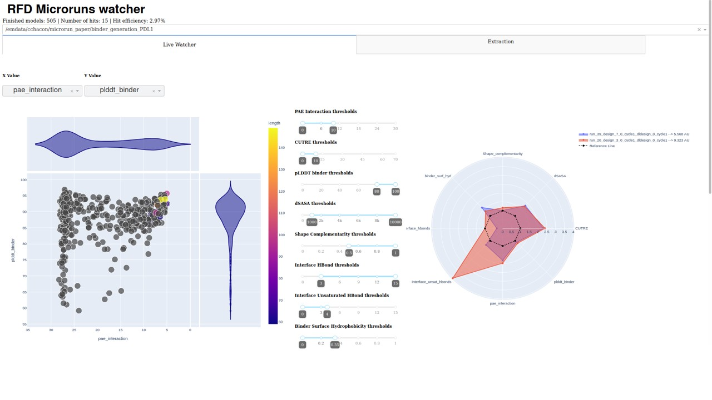
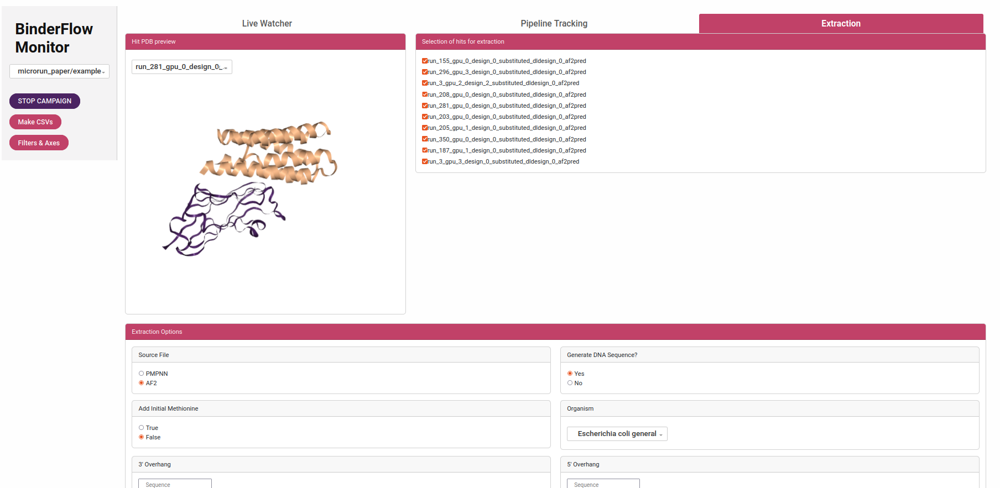

# MICRORUN & WATCHER

These are a few scripts intended to provide a platform for users of SLURM-based small HPC that can help to atomize the task of protein design (*microrun.sh*), as well as check *on the fly* how the runs are performing and help with the selection of designs for subsequent DNA order (*watcher.py*).

Right now, it can be used with RosettaFold Diffusion (for which we have added some physical-based scorings using PyRosetta)

Hope you can find them helpful!

This repository is organized as follows:

- **microrun**: In this folder is stored all the code needed to run the binder design process using the microrun structure 
    
    - **scripts**: This is where the different scripts used in the microrun are stored, as well as some other useful tools for the protein design process.
    - **slurm_submit**: In this folder we store the SLURM submit scripts
    - **master_scripts**: In this folder we store the scripts running each of the steps 

- **monitoring_utils**: In this folder there are all the utils used with the watcher

Outside of these folders there are 5 different files:
- **config.sh**: A config file to set all the paths for the different software that microrun uses, the environment names, and the SLURM configurations
- **install_watcher.sh**: A script to install the watcher environment, which is also used in some steps of the microrun campaign run
- **microrun.sh**: The script to run a binder design campaign following the microrun structure
- **microrun_watcher.py**: The script to visualize on the fly how the campaign is going, as well as to select and get the design sequences
- **sequence_diversity.sh**: The script to run the sequence diversity option, which consists of generating only different sequences for a backbone using the microrun structure

## HOW IT WORKS

### MICRORUN

Protein design is a time-consuming process, and making a single run of designs can sequester a node of the cluster for a long time, dampening the work of the rest of the cluster users.

The microrun structure splits one design project into many small runs, which can be run in parallel. In each run, 10 binders are designed and evaluated per GPU in a node, working each run as an independent binder design project. The scoring of each design is extracted within the microrun process and organized in a csv file to facilitate live monitoring of the run. A JSON file with all the binder design project metadata to ensure reproducibility and a folder with each subtask is also added. This structure is highly flexible and can be adapted to the pipelines used for the different generative models. In this GitHub we provide implementation for RFD, but we plan to add other generative models. 

The microrun structure is as follows:
```
project_dir/
├── input/                                                                       # Directory with the input structure
    ├── input_file.pdb                                                           # Target structure  
    └── template_file.pdb                                                        # Template structure
├── outputs/                                                                     # Logs generated by RFD
├── output/                                                                      # Directory with the designs
    ├── run_1/
        ├── run_1_gpu_0_design_0.pdb                                             # Initial structure generation (Gly backbone)
        ...                                         
        ├── run_1_gpu_0_design_N.pdb                                             # Initial structure generation (Gly backbone)
        ├── run_1_gpu_1_design_0.pdb                                             # Initial structure generation (Gly backbone)
        ...
        ├── run_1_gpu_1_design_N.pdb                                             # Initial structure generation (Gly backbone)
        ├── run_1_gpu_K_design_N.pdb
        ├── run_1_gpu_0_design_0_substituted.pdb                                 # Initial structure with the target substituted with the template
        ...
        ├── run_1_gpu_0_design_N_substituted.pdb                                 # Initial structure with the target substituted with the template
        ├── run_1_gpu_K_design_N_substituted.pdb                                 # Initial structure with the target substituted with the template
        ...
        ├── run_1_input_design_1_input.silent                                    # Silent input of pMPNN
        ├── run_1__design_1_input_out.silent                                     # Silent output of pMPNN and input of AF2-IG
        ├── run_1_design_1_input_out_af2.silent                                  # Silent output of AF2-IG and input of scoring.py
        ├── run_1_design_1_input_out_af2.sc                                      # Scoring of AF2-IG
        ├── pae_run_1_gpu_0_design_N_substituted_dldesign_0_cycle1_af2pred.json  #JSON with the PAE and pLDDT info of the AF2 prediction
        ...
        ├──traj/                                                                 #Directory where the trajectories are stored (for cool movies)
        └── slurm_logs/                                                          # logs of each of the jobs send to the cluster
            ├── [job_number].out                                                 # outfile of the job 
            └── [job_number].err                                                 # errorfile of the job      
    ├── run_2/
        ...
    ...
    └── run_I/
        ...
├──hits/                                                                         # Folder with all the design hits (created by watcher)
    ├──run_X_gpu_M_design_Y_substituted_dldesign_0_cycle1_af2pred.pdb            # Hits pdb (created by watcher)
    ├──fastas/                                                                   # Folder with the fastas sequence of the hits
    └── dna_seqs/                                                                # Folder with the optimized dna sequence of the hits, ready to synthesize
├── Scoring_Stats.csv                                                            # CSV file with the scoring of all designs
├── [project_name].log                                                           # Log file of the project with all the slurm job information
└── input.json                                                                   # JSON with metadata of the run to ensure its reproducibility

```

We add an intermediate step between the binder generation and the sequence assignment in which we substitute the cropped input for a desired template and check both the presence of steric clashes between binder and target and the presence of a large enough hydrophobic core to save computational resources (we remove from the sequence assignment and scoring those designs which are single helix or hairpins).

### WATCHER

The watcher is a Dash-based app which allows you to follow *on-the-fly* the binder generation process, as well as visualize and extract the desired hits, both protein and cDNA sequence. Moreover, and using CodonTransformer, you can select to which organism to adapt the sequence and your desired overhang to both 5' and 3'.

We find this script specially useful to follow runs in which you are not sure of the success of the binder generation, allowing you to stop the run and change the conditions before a lot of computational resources have been employed; or to end a run once you have enough hits, without having to generate more than needed, saving time and energy. Moreover, it makes the binder design selection easier, improving the probabilities of success, and already preparing all the information for DNA order.

The watcher has two different tabs, which are described in the following sections:

#### Live visualization

The watcher 'Live Visualization' tab is composed of a Scatter plot, in which you can compare design metrics. 

Those designs that do not pass the filtering metrics are colored in grey, while those that indeed fulfil all the requirements are colored according to its length. If none of the designs pass the metrics, all are colored according to its length.

At the left of the scatterplot, under `filters & axes`, we have range sliders that allow us to select the thresholds that should be met for a design to be considered a hit. We have set some defaults values based on experience, but feel free to use the filtering you consider works best!. There you can also select the x and y-axis values between all the scoring metrics extracted, and stop the campaign if you think you do not need more designs.

If you want to make a pairwise comparison between designs, you can click two different points of the scatterplot, and on the right, a radar plot comparing their more important metrics will appear. The reference line marks the reference value (all metrics are normalized with respect to its threshold in this plot).

On the upper right, you can see the area units of each plot in the radar to make numerical comparisons between designs in all metrics

`Note: This Area Unit comparison has not been extensively tested, and it gives the same weight to all parameters, so it needs further validation. If you have data or an idea to refine this comparison further, please let us know! :)`



#### Pipeline Tracking

Under the pipeline tracking tab there is a dataframe which details the state of each instance, as well as it indicates if one of this instances has failed

#### Extraction

The third tab is the extraction tab. In this tab, you can see the structures of those designs that can be considered hits (according to the metrics you impose in the Live Visualization tab).
`Note: Since we work with silent files to make everything more organized, only the initial backbone designs can be inspected. However, we have noticed that if the prediction metrics are good, the backbone design and the final AF2-IG prediction are highly similar`

Once you have inspected all the structures, you can select those that are interesting to you with the checklist on the right and then extract it. The PDB information is extracted using Rosetta tools, the fasta is generated using Biopython package and the DNA sequence is generated using CodonTransformer

On the bottom of the tab, you can select the extraction preferences, among them:

- Extract the file from pMPNN output or AF2 output
- Generate a DNA sequence
- Add an initial methionine
- Select the organism for which you want to optimize the sequence 
- Add a 3' and 5' overhang 
- Reach a certain length adding a padding sequence with a selected GC content
- Select enzymes to check for enzyme restriction sites and modify them to avoid undesired cuts

*While this method has been in use for some time and sequences usually appear accurate, there is still a possibility of errors. We recommend thoroughly verifying all sequences before ordering.*

Finally, the extract hits button allows you to extract the hits.

`Note: We have not extensively tested the DNA sequence extraction. Before ordering, make sure everything is correct`



### OTHER SCRIPTS

We also have created some scripts that can be useful for binder design. These scripts are stored in the `scripts` folder and are:

- `contigs_map_getter.py`: returns the contigs maps of the given protein (provided through -i flag). You can also get the contigs for partial diffusion adding the flag --partial_diff
- `RMSD_rosetta.py`: A script which uses PyRosetta to make all-by-all pairwise comparisons of the hits designs and clusterized them by similarity. This script can be useful for selecting structurally diverse designs in an initial design screening
- `sequence_diversity.sh`: A script that allows you to make microrun-structured design project starting from a pdb (perform pMPNN, AF2 and PyRosetta). Useful to make sequence exploration once you have a good structure.


## INSTALLATION

1. Clone this repository

`git clone https://github.com/cryoEM-CNIO/Binder_Design_Watcher [install_folder]`

Where install_folder is the path where you want to install it.

`Note: Be sure that the path is accessible for the HPC cluster`

2. For the *microrun.sh* script, no additional package needs to be installed apart from the installation of [RFD](https://github.com/RosettaCommons/RFdiffusion) and a fork version of [dl_binder_design](https://github.com/CarlosChacon-cell/dl_binder_design) (needed to solve some performance issues). The installation is detailed in the respective GitHubs

3. Run the following script from the cloned repository folder:

`bash install_watcher.sh --pkg_manager PKG_MANAGER `

Where PKG_MANAGER is whether conda or mamba (the default and the one we use is conda)

As with RFD, this installs PyRosetta, which requires a license for commercial purposes.

4. After cloning the repository and installing the environment, you have to set all your local information in **config.sh** (Paths to the RFD, pMPNN and AF2IG directory, environments names and slurm configuration).  


## EXAMPLE USAGE

To generate binders with `microrun.sh`, the information can be provided through flags (as in the examples) or through a JSON file that contains all the information (--json input.json):

input.json
```json
{
    "input": "input/PDL1_trimmed.pdb",
    "template": "input/PDL1_trimmed.pdb",
    "max_threads": "2",
    "rfd_contigs": "[ 65-155/0 B1018-1132/0 ]",
    "rfd_hotspots": "[B1054,B1068]",
    "rfd_ndesigns": 1,
    "pmp_nseqs": 1,
    "pmp_relax_cycles": "0",
    "partial_diff": "False",
    "noise_steps": "20",
    "noise_scale": "1",
    "checkpoint": "/apps/rosetta/RFDiffusion/models/Complex_base_ckpt.pt",
    "node": "",
    "soluble_pMPNN": "False",
    "distance": "10",
    "core": 0.05,
    "fixed_residues": "None",
    "hits_number": 48
}
```
The path of the checkpoint must be adequately modified ot your settings

To perform initial binder generation with flags:

```bash
cd Examples/RFD_binder_generation
python3 ../../scripts/contig_map_getter.py -i input/PDL1_trimmed.pdb # Copy the output and paste it in --rfd_contigs brackets
bash ../../microrun.sh --input input/PDL1_trimmed.pdb --template input/PDL1_trimmed.pdb --max_threads 4 --rfd_contigs "[ 65-155/0 B1018-1132/0 ]" --rfd_hotspots "[B1054,B1068]"  > campaign_example.log 2>&1 &
```

To perform initial binder generation with JSON:

```bash
cd Examples/RFD_binder_generation
bash ../../microrun.sh --json input.json  > campaign_example_json.log 2>&1 &
```


To perform partial diffusion:
```bash
cd Examples/RFD_partial_diffusion
bash ../../microrun.sh --input input/PDL1_modified.pdb --template input/PDL1_modified.pdb --max_threads 4 --partial_diff "True"  > campaign_example_pd.log 2>&1 & #To check what things you can modify, see the flags sections next
```

To perform sequence diversity:

```bash
cd Examples/Sequence_diversity
bash ../../sequence_diversity.sh --input input/run_20_design_3_substituted_dldesign_0_cycle1_dldesign_0_cycle1_af2pred.pdb --threads 2 --max 1000 --nseqs 50 --fr 0  > sd_2.log 2>&1 &
```

To activate the watcher ():

```bash
cd Examples
conda activate watcher
python3 ../../microrun_watcher.py
```

By default, watcher.py is located at port 8050. If you want to open more than one watcher at the same time, run --port 805X

### MICRORUN FLAGS

The microrun script admits different flags for binder design. Many of them have defaults set, but others must be defined by the user.

**The mandatory flags are:**
- `--input`: Path to the target structure
- `--template`: Path to the template structure (uncropped or less cropped version of the input)
- `--rfd_contigs`: Contigs map description of the input structure and binder length. This is optional for Partial Diffusion processes
- `--rfd_hotspots`: Hotspot residues for the binder design (The binder structure is going to be generated close to these residues)
- `--max_threads`: Number of *runs* to be executed in parallel (each *run* is one node occupied)

**The optional flags are:**
- `--pmp_nseqs`: Number of sequences to be generated by pMPNN. Default=1
- `--pmp_relax_cycles`: Number of Fast Relax cycles to be performed by pMPNN. Default=1

`Note: Due to pMPNN incompatibilities, only one sequence can be generated if FR is used `

- `--partial_diff`: Boolean flag to determine if you want to perform normal binder generation or partial diffusion. Default=False
- `--noise_steps`: Number of steps to perform in the partial diffusion protocol. Default=20. This flag is ignored outside of partial diffusion.
- `--noise_scale`: Amount of noise to add at each step during partial diffusion. Default=1. This flag is ignored outside of partial diffusion.
- `--ckp`: Checkpoint path to bias the structure generation. Default="Complex_base_ckpt.pt"
- `--node`: Node in SLURM to which the job wants to be sent. Default=''
- `--hits_number`: Number of designs which pass the filtering metrics, after which the process stops. Default=100
- `--residues`: List of residues from the design you want to fix. It should be provided between brackets, separating residues with commas and defining 
ranges with -. If you are doing scaffolding, the template structure must have the chain A you are using as scaffold (with the same length you are using for scaffolding).For example: "[1,3,10-20]" Default="None"
- `--json`: Json file with all the info above. Default="None"

### SEQUENCE DIVERSITY FLAGS
***The mandatory flags are:**
- `--input`: Path to the target structure
- `--threads`: Number of *runs* to be executed in parallel (each *run* is one node occupied)
- `--max`: Total number of sequences to be generated

**The optional flags are:**
- `--residues`: List of residues from the design you want to fix. It should be provided between brackets, separating residues with commas and defining ranges with -. If you are doing scaffolding, the template structure must have the chain A you are using as scaffold (with the same length you are using for the scaffolding).For example: "[1,3,10-20]" Default="None"
- `--fr`: Number of Fast Relax cycles to perform (_No more than one). Default=1
- `--nseqs`: Number of sequences to generate per run. Default=1
`No more than 1 sequence can be generated if the FR is set to 1`


## SCORING METRICS

There are several metrics to score your binder. The more general ones (and probably the ones which are more faithful) are the pLDDT_binder and the PAE_interaction, but we also offer many more to be used.

- *pLDDT_binder*: How confident is AF about the binder folding. Recommended over 80

- *PAE_interaction*: How confident is AF about the binder and target relative positions. Recommended below 10.

- *CUTRE*: This is the PAE_interaction, filtered using only the interface residues and weighted by the pLDDT of the interface residues. Recommended over 10.

- *dG*: Free energy of the interface. To be considered good, these values should be negative, but none of the hits designs have good dG. Recommended to be lower than 0, but we do not use it.

- *dSASA* : Solvent accessible surface area which is ocluded by the binding. Larger values means a larger binding interface, we use 1000 as threshold but for smaller interfaces other values can be used 

- *dG/dSASA ratio*: Normalised binding energy by the binding interface surface

- *Shape_complementarity*: How well the binder and target structure fit. It goes from 0 to 1, anything above 0.50 is considered sufficient and above 0.8 is considered a good shape match

- *Packstat*: This stat is used to measure the cavity holes inside a protein structure. Real structures tend to avoid these holes, and thus their score is large (close to 1). Moreover, the [authors](https://onlinelibrary.wiley.com/doi/10.1002/pro.8) find out a correlation between a X-Ray structure resolution and its Packstat metric. Above 0.65 is good, but we do not use it.

- *SAP_score*: Surface Aggregation Propensity, a measurement of how prone to aggregation is a protein. Pyrosetta Doc isn't very understandable, but I think it relates to the Developability Index. Below 10 means high stability, between 10 and 20 medium stability.

- *binder_int_hyd*: Binder Interface Hydrophobicity. Measures from 0 to 1 the proportion of hydrophobic residues present in the binder interface (only binder proportion). 

- *binder_surf_hy*: Binder Surface Hydrophobicity. Measures from 0 to 1 the proportion of hydrophobic residues present on the binder's surface. Recommended to be lower than 0.35 

- *interface_hbonds*: Number of hydrogen bonds at the interface. Recommended larger than  3

- *interface_unsat_hbonds*: Number of unsatisfied buried hydrogen bonds at the interface. Recommended to be lower than 4. WARNING! We had to slightly change the code from BindCraft; might need further validation.

- *RMSD*: RMSD between the design by RFD and the prediction by AF2. Values below 2 A are probably accurate enough, although there is no data about where to put the threshold.

- *ipSAE*: Metric developed by Dunbrack and explained [here](https://www.biorxiv.org/content/10.1101/2025.02.10.637595v1.full.pdf). Although more extensive studies should be made, anything over 0.6 probably can be considered a true positive
 
Most of these filters are "inspired" by the ones published by Martin Pacesa for BindCraft. Thank you! (Highly recommend checking their work!)

## CONTRIBUTIONS

If you have any ideas and want to collaborate, feel free to implement them or ask us to do them! :)
