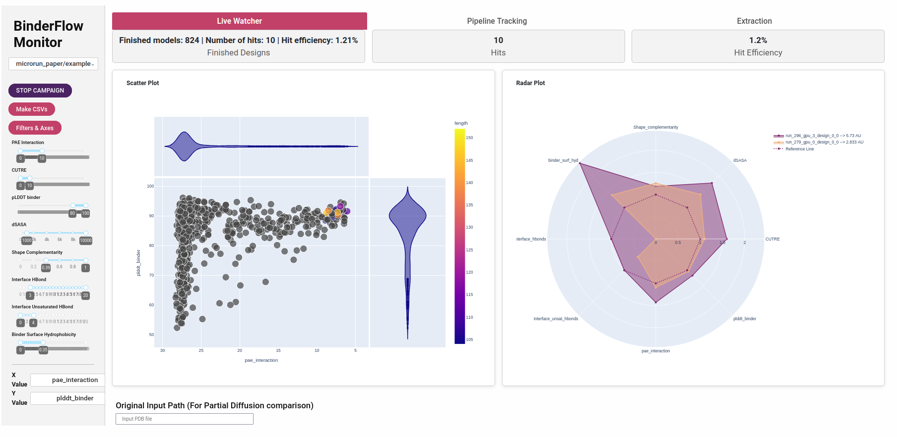

# MICRORUN & WATCHER

These are a few scripts intended to provide a platform for users of SLURM based small HPC that can help to atomize the task of protein design (*microrun.sh*), as well as check *on the fly* how the runs are performing and help with the selection of designs for subsequent order (*watcher.py*).

Right now it can be used with RosettaFold Diffusion (for which we have added some physical based scorings using PyRosetta)

Hope you can find them useful!

This repository is organized as follows:
-**microrun**: In this folder is stored all the code needed to run the binder design process using the microrun structure 
    - **scripts**: This is where the different scripts use in the microrun are stored, as well as some other useful design for the protein design process.
    - **slurm_submit**: In this folder we store the SLURM submit scripts
    - **master_scripts**: In this folder the scripts running each of the steps are stored 
- **monitoring_utils**: In this folder there are all the utils used with the watcher

Outside of this folder you have 5 different files:
- **config.sh**: A config file to set all the paths for the different softwares that microrun uses, the environment names and the SLURM configurations
- **install_watcher.sh**: A script to install the watcher environment, which is also used in some steps of the microrun campaing run
- **microrun.sh**: The script to run a binder design campaing following the microrun structure
- **microrun_watcher.py**: The script to visualize on the fly how the campaign is going, as well to select and get the designs sequences
- **sequence_diversity.sh**: The script to run the sequence diversity option, which consists in generating only differnet sequences for a backbone using the microrun structure
## HOW IT WORKS

### MICRORUN

Protein design is a time consuming process, and making a single run of designs can sequester a node of the cluster for a long time, dampening the work of the rest of the cluster users.

The microrun structure splits one design project into multiple runs, which can be run in parallel. In each of these runs, 10 binders are designed and evaluated per GPU in a node, working each run as an independent binder design project. The scoring of each design is extracted within the microrun process and organized in a csv file to facilitate live monitoring of the run. A JSON file with all the binder design project metadata to ensure reproducibility and a folder with each of the subtasks are also added. This structure is highly flexible and can be adapted to the pipelines used for the different generative models. In this GitHub we provide implementation for RFD, but we plan to add other generative models. 

The microrun structure is as follows:
```
project_dir/
├── input/                                                                  # Directory with the input structure
    ├── input_file.pdb                                                      # Target structure  
    └── template_file.pdb                                                   # Template structure
├── outputs/                                                                # Logs generated by RFD
├── output/                                                                 # Directory with the designs
    ├── run_1/
        ├── run_1_design_10.pdb                                             # Initial structure generation (Gly backbone) (The design number marks the gpu in which it has run)
        ...                                         
        ├── run_1_design_19.pdb                                             # Initial structure generation (Gly backbone) (The design number marks the gpu in which it has run)
        ├── run_1_design_20.pdb                                             # Initial structure generation (Gly backbone) (The design number marks the gpu in which it has run)
        ...
        ├── run_1_design_29.pdb                                             # Initial structure generation (Gly backbone)
        ├── run_1_design_10_substituted.pdb                                  # Initial structure with the target substituted with the template  (The design number marks the gpu in which it has run)
        ...
        ├── run_1_design_19_substituted.pdb                                  # Initial structure with the target substituted with the template  (The design number marks the gpu in which it has run)
        ├── run_1_design_20_substituted.pdb                                  # Initial structure with the target substituted with the template  (The design number marks the gpu in which it has run)
        ...
        ├── run_1_design_29_substituted.pdb                                  # Initial structure with the target substituted with the template  (The design number marks the gpu in which it has run)

        ├── run_1_input_design_1_input.silent                                # Silent input of pMPNN  (The design number marks the gpu in which it has run)
        ├── run_1__design_1_input_out.silent                                 # Silent output of pMPNN and input of AF2-IG  (The design number marks the gpu in which it has run)
        ├── run_1_design_1_input_out_af2.silent                              # Silent output of AF2-IG and input of scoring.py (The design number marks the gpu in which it has run)
        ├── run_1_design_1_input_out_af2.sc                                  # Scoring of AF2-IG (The design number marks the gpu in which it has run)
        ├── pae_run_1_design_10_substituted_dldesign_0_cycle1_af2pred.json   #JSON with the PAE and pLDDT info of the AF2 prediction (The design number marks the gpu in which it has run)
        ...
        ├── pae_run_1_design_19_substituted_dldesign_0_cycle1_af2pred.json   #JSON with the PAE and pLDDT info of the AF2 prediction           
        └──traj/                                                            #Directory where the trajectories are stored (for cool movies)
    ├── run_2/
        ...
    ...
    └── run_N/
        ...
├──hits/                                                                    # Folder with all the design hits (created by watcher)
    ├──run_X_design_Y_substituted_dldesign_0_cycle1_af2pred.pdb             # Hits pdb (created by watcher)
    ├──fastas/                                                              # Folder with the fastas sequence of the hits
    └── dna_seqs/                                                           # Folder with the optimized dna sequence of the hits, ready to synthesize
├── Scoring_Stats.csv                                                       # CSV file with the scoring of all designs
├── [project_name].log                                                      # Log file of the project with all the slurm job information
├── input.json                                                              # JSON with metadata of the run to ensure its reproducibility
└── slurm_logs/                                                             # logs of each of the jobs send to the cluster
    ├── [job_number].out                                                    # outfile of the job 
    └── [job_number].err                                                    # errorfile of the job      
```

We add an intermediate step between the binder generation and the sequence assignment in which we substitute the cropped input for a desired template, and check both the presence of steric clashes between binder and target and the presence of a large enough hydrophobic core to save computational resources (we remove from the sequence assignment and scoring those designs which are single helix or hairpins).
### WATCHER

The watcher is a Dash based app which allows you to follow *on-the-fly* the binder generation process, as well as visualize and extract the desired hits, both protein and cDNA sequence. Moreover, and usign CodonTransformer, you can select to which organism adapt the sequence, and your desired overhang to both 5' and 3'.

We find this script specially useful to follow runs in which you are not sure of the success of the binder generation, allowing you to stop the run and change the conditions before a lot of computational resources have been employed; or to end a run once you have enough hits, without having to generate more than needed, saving time and energy. Moreover, it makes the binder design selection easier, improving the probabilities of success and already prepares all the information for DNA order.
The watcher has two different tabs, which are described in the following sections:

#### Live visualization

The watcher 'Live Visualization' tab is composed of a Scatter plot, in which you can compare design metrics. You can select the x and y axis value between all the scoring metrics extracted.
Those designs that do not pass the filtering metrics are colored in grey, while those that indeed fulfill all the requirements are colored according to its length. If none residue pass the metrics, all are colored according to its length.

Next to the scatterplot we have range sliders that allow us to select the thresholds consider for a hit. The defaults are the consider consensus, but feel free to use the filtering you consider work best!

If you want to make pairwise comparison between designs you can click two different points of the scatterplot, and on the right a radar plot comparing their more important metrics will appear. The reference line marks the reference value (all metrics are normalized respect to its threshold in this plot).
On the upper right you can see the area units of each plot in the radar, to make numerical comparisons between designs in all metrics
`Note: This Area Unit comparison has not been extensively tested. It gives the same weight to all parameters, so probably it is somewhat flawed. If you have data or an idea to further refine this comparison, please tell us! :)`

On the bottom left, we have a datatable in which each run progression is detailed, and whether if any run has failed.

On the bottom right we have a `STOP CAMPAIGN` button. This button creates a `campaign_done` file in the microrun directory, prompting that the microrun stops (all the runs already sent still run until finished)



#### Extraction

The second tab is the extraction tab. In this tab you can see the structures of those designs that can be consider hits (according to the metrics you impose in the Live Visualization tab).
`Note: Since we work with silent files to make everything more organized, only the initial backbone designs can be inspected. However, we have noticed that if the prediction metrics are good, the backbone design and the final AF2-IG prediction are pretty similar`

Once you have inspected all the structures, you can select those that are interesting to you with the checklist on the right, and then extract it. The pdb information is extracted using Rosetta tools, the fasta is generated using Biopython package and the DNA sequence is generated using CodonTransformer 
On the bottom of the tab you can select the extraction preferences, among them:

- Extract the file from pMPNN output or AF2 output
- Generate a DNA sequence
- Add an initial methonine
- Select the organism for which you want to optimize the sequence 
- Add a 3' and 5' overhang 
- Reach a certain lenght adding a padding sequence with a selected GC content
- Select enzymes to check for enzyme restriction sites and modify them to avoid undesired cuts

Finally the extract hits button allows you to extract the hits.


### OTHER SCRIPTS

We also have created some scripts that we think can be useful for binder design. These scripts are stored at the `scripts` folder and are:

- `contigs_map_getter.py`: returns the contigs maps of the given protein (provided through -i flag). You can also get the contigs for partial diffusion adding the flag --partial_diff 
- `RMSD_rosetta.py`: A script which uses PyRosetta to make all-by-all pairwise comparisons of the hits designs and clusterized them by similarity. This script can be useful to select structurally diverse designs in an initial design screening
- `sequence_diversity.sh`: A script that allows you to make microrun-structured design project starting from a pdb (perform pMPNN, AF2 and PyRosetta). Useful to make sequence exploration once you have a good structure.

#### 
## INSTALLATION

First, you need to clone this repository, 

`git clone https://github.com/cryoEM-CNIO/Binder_Design_Watcher [install_folder]`

Where install_folder is the path where you want to install it.

`Note: Be sure that the path is accessible for the HPC cluster`

For the *microrun.sh* script no additional package is needed to be installed, apart from the installation of [RFD](https://github.com/RosettaCommons/RFdiffusion) as described in its GitHub.

For the *watcher.py*, run the following code from the cloned repository folder:

`bash install_watcher.sh --pkg_manager PKG_MANAGER `

Where PKG_MANAGER is whether conda or mamba (the default and the one we use is conda)

As it happens with RFD, this installs PyRosetta, which requires a license for commercial purposes.

After cloning the respository and installing the environment, you have to set all your local information in **config.sh** (Paths to the RFD, pMPNN and AF2IG directory, environments names and slurm configuration).  

## EXAMPLE USAGE

To generate binders with microrun.sh, do
```bash
cd Examples/RFD_binder_generation
python3 ../../scripts/contig_map_getter.py -i input/PDL1_modified.pdb # Copy the output and paste it in --rfd_contigs brackets
bash ../../microrun.sh --input input/PDL1_modified.pdb --template input/PDL1_modified.pdb --max_threads 4 --rfd_contigs "[ 50-125 B1001-1115/0 ]" --rfd_hotspots "[ B1007, B1011, B1025, B1029 ]"  > campaign_example.log 2>&1 &
```

To perform partial diffusion do: 
```bash
cd Examples/RFD_partial_diffusion
python3 ../../scripts/contig_map_getter.py # Copy the output and paste it in --rfd_contigs brackets
bash ../../microrun.sh --input input/PDL1_modified.pdb --template input/PDL1_modified.pdb --max_threads 4 --partial_diff "True"  > campaign_example_pd.log 2>&1 & #To check what more things you can modify, see the flags sections next
```

To perform sequence diversity:

```bash
cd Examples/Sequence_diversity
bash ../../sequence_diversity.sh --input input/run_20_design_3_substituted_dldesign_0_cycle1_dldesign_0_cycle1_af2pred.pdb --threads 2 --max 1000 --nseqs 50 --fr 0 --fixed "[1-20]"  > sd_2.log 2>&1 &
```

To activate the watcher, run:

```bash
conda activate watcher
python3 ../../microrun_watcher.py 
```

Watcher can be used with both microrun and sequence diversity. By default, watcher.py is located at port 8050. If you want to open more than one watcher at the same time, run --port 805X

### MICRORUN FLAGS

The microrun script admits different flags for binder design. Many of them have defaults set, but other must be defined by the user.

**The mandatory flags are:**
- `--input`: Path to the target structure
- `--template`: Path to the template structure (uncropped or less cropped version of the input)
- `--rfd_contigs`: Contigs map description of the input structure and binder lenght. This is optional for Partial Diffusion processes
- `--rfd_hotspots`: Hotspot residues for the binder design (The binder structure is going to be generated close to these residues)
- `--max_threads`: Number of *runs* to be executed in parallel (each *run* is one node occupied)

**The optional flags are:**
- `--pmp_nseqs`: Number of sequences to be generated by pMPNN. Default=1
- `--pmp_relax_cycles`: Number of Fast Relax cycles to be performed by pMPNN. Default=1

`Note: Due to pMPNN incompatibilities, only one sequence can be generated if FR is used `
- `--partial_diff`: Boolean flag to determine if you eant to perform normal binder generation or partial diffusion. Default=False
- `--noise_steps`: Number of steps to perform in the partial diffusion protocol. Default=20. This flag is ignored outside of partial diffusion.
- `--noise_scale`: Amount of noise to add at each step during partial diffusion. Default=1. This flag is ignored outside of partial diffusion.
- `--ckp`: Checkpoint path to bias the structure generation. Default="Complex_base_ckpt.pt"
- `--node`: Node in SLURM to which the job wants to be send. Default=''
- `--soluble_pMPNN`: Boolean flag to redesign the non-interacting binder surface usign pMPNN_soluble. Default=False
- `--distance`: Distance from the protein-protein interface to start redesigning the sequnce usign pMPNN soluble. Default=10
- `--hits_number`: Number of designs which pass the filtering metrics after which the process stops. Default=100
- `--core`: Threshold of binder fraction core residues for filtering (filtering no plausible structures like most of two helices bundles).  Default=0.05
- `--residues`: List of residues from the design you want to fix. Useful in the case of scaffolds, to avoid full pMPNN binder sequence reconstruction. Default=""

`Note: The core threshold is extracted using F1-score from a 1000 design datasets, it should be improved, not too strict`

## ALTERNATIVE SCORING METRICS

There are several metrics to score your binder. The more general ones (and probably the ones which are more faithful) are the pLDDT_binder and the PAE_interaction, but we also offer many more to be used.

- *pLDDT_binder*: How confident is AF about the binder folding. Recommended over 80

- *PAE_interaction*: How confident is AF about the binder and target relative positions. Recommended below 10.

- *CUTRE*: This is the PAE_interaction, filtered using only the interface residues and weighted by the pLDDT of the interface residues. Recommended over 10.

- *dG*: Free energy of the interface. To be considered good these values should be negative, but none of the hits designs have good dG. Recommended to be lower than 0, but we do not use it.

- *dSASA* : Solvent accessible surface area which is ocluded by the binding. Larger values means a larger binding interface, we use 1000 as threshold but for smaller interfaces other values can be used 

- *dG/dSASA ratio*: Normalised binding energy by the binding interface surface

- *Shape_complementarity*: How well the binder and target structure fit. It goes from 0 to 1, anything above 0.50 is considered sufficient and above 0.8 is considered a good shape match

- *Packstat*: This stat is used to measure the cavity holes inside a protein structure. Real structures tend to avoid these holes, and thus their score is large (close to 1). Moreover, the [authors](https://onlinelibrary.wiley.com/doi/10.1002/pro.8) find out a correlation between a X-Ray structure resolution and its Packstat metric. Above 0.65 is good, but we do not use it.

- *SAP_score*: Surface Aggregation Propensity, a measurement of how prone to aggregation is a protein. Pyrosetta Doc isn't very understandable, but I think it relates to the Developability Index. Below 10 means high stability, between 10 and 20 medium stability.

- *binder_int_hyd*: Binder Interface Hydrophobicity. Measures from 0 to 1 the proportion of hydrophobic residues present in the binder interface (only binder proportion). 

- *binder_surf_hy*: Binder Surface Hydrophobicity. Measures from 0 to 1 the proportion of hydrophobic residues present in the surface of the binder. Recommended to be lower than 0.35 

- *interface_hbonds*: Number of hydrogen bonds at the interface. Recommended larger than  3

- *interface_unsat_hbonds*: Number of unsatisfied buried hydrogen bonds at the interface. Recommended to be lower than 4. WARNING! I have to slightly change the code from BindCraft, maybe this computation has changed, not 100%

- *RMSD*: RMSD between the design by RFD and the prediction by AF2. Values below 2 A are probably accurate enough, although there is no data about where to put the threshold
- *ipSAE*: Metric developed by Dunbrack and explained [here](https://www.biorxiv.org/content/10.1101/2025.02.10.637595v1.full.pdf). Although more extensive studies should be made, anything over 0.6 probably can be considered a true positive
 
Most of this filters are "inspired" from the ones published by Martin Pacesa for BindCraft. Thank you! (Highly recommend checking their work!)

## CONTRIBUTIONS

If you have any idea and want to collaborate, feel free to implement it or ask us to do it! :)